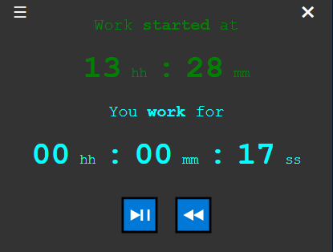

# Timer

A simple timer to measure your working time written using [Electron](https://www.electronjs.org/) and JS.

## Usage

Please see the releases on the right hand side of this website, download the executable, and simply run it.
